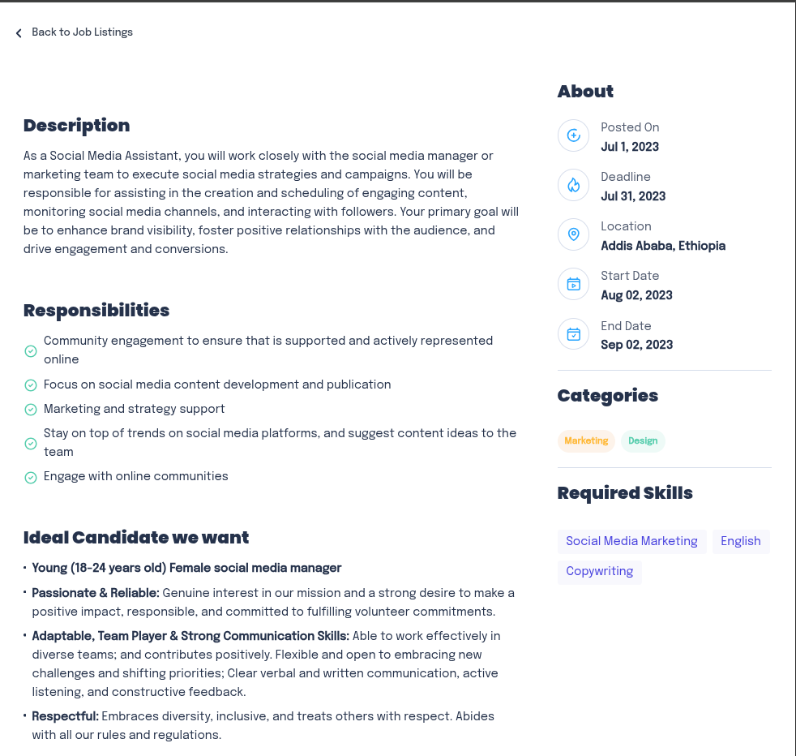
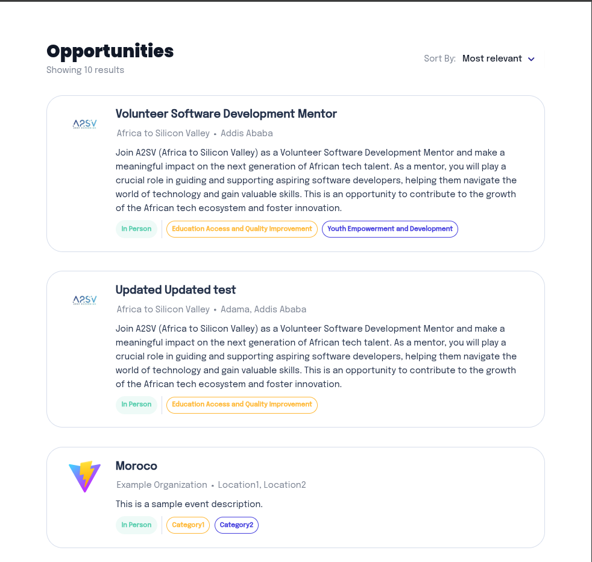
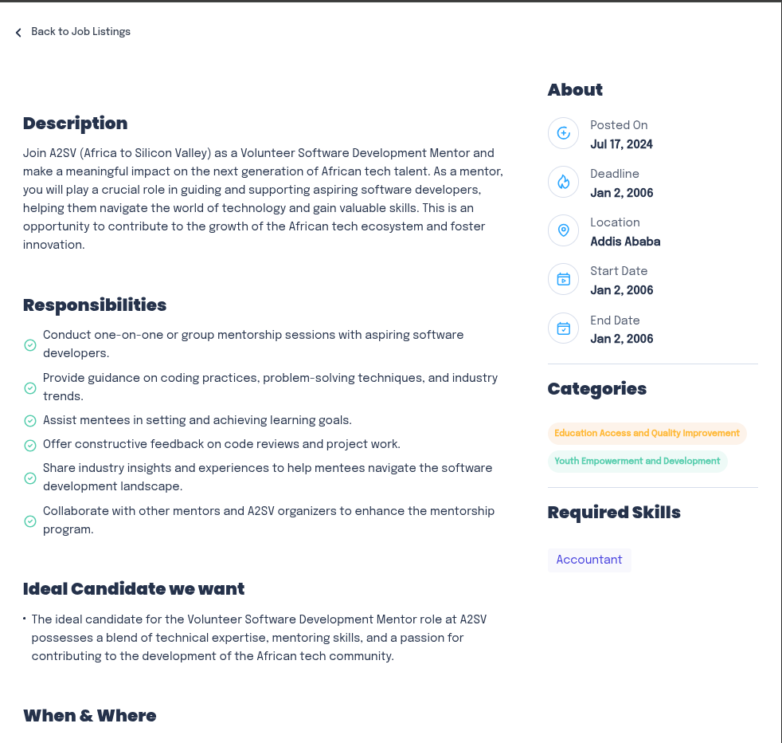
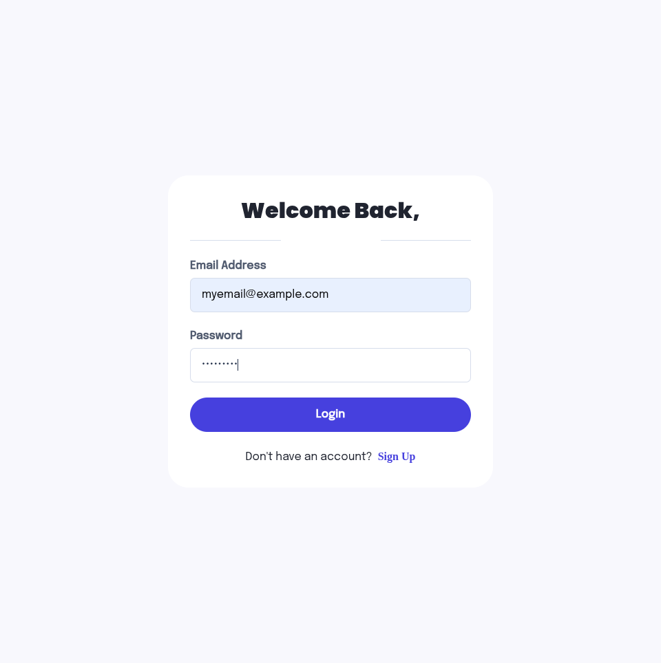
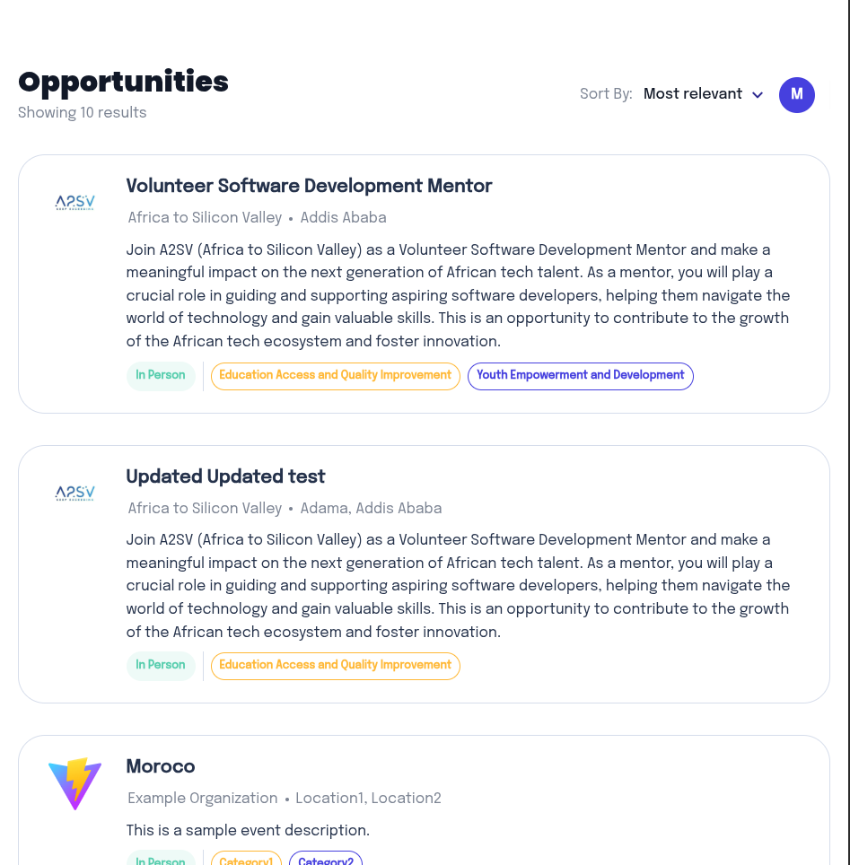
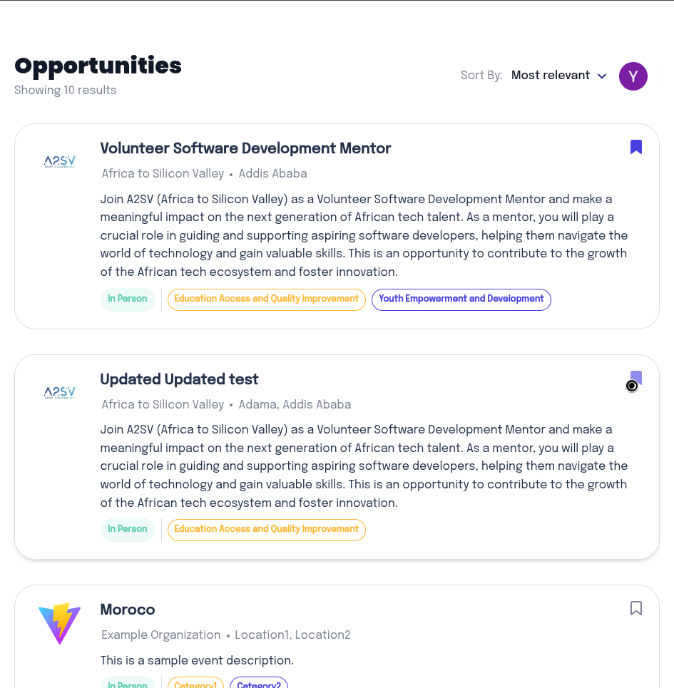

# Job Listing Dashboard

A modern, responsive job listing dashboard built with React, TypeScript, and Tailwind CSS. This application displays job opportunities with filtering, sorting, and pagination capabilities, integrated with a live API.

This project is part of the **a2sv** program, a comprehensive software engineering training initiative.

## Features

- **Job Card Display**: Beautiful card-based layout showcasing job opportunities
- **Sorting**: Sort jobs by "Most relevant" or "Most recent"
- **Pagination**: Navigate through job listings with pagination controls
- **API Integration**: Fetches real-time data from Akil Backend API
- **Responsive Design**: Fully responsive layout that works on all screen sizes
- **Type Safety**: Built with TypeScript for enhanced developer experience
- **Theme System**: Centralized theme configuration for colors, dimensions, fonts, and typography

## Task 6: Building Job Listing Application

### Design Implementation

This project was built by carefully copying and implementing a design from Figma. The following describes how the design was translated into code:

### Design Copy Process

#### Layout and Dimensions
- **Direct Copy**: All layout structures and dimensions were directly copied from the Figma design file
- **Precise Measurements**: Spacing, padding, margins, and sizes were extracted exactly as specified
- **Container Widths**: Maximum container widths for cards and dashboard were implemented as specified

#### Fonts
- **Google Fonts Import**: Fonts (Epilogue and Poppins) were imported from Google Fonts
- **Font Weights**: All font weights were applied as specified in the design
- **Typography Scale**: Font sizes, line heights, and letter spacing were matched exactly

#### Icons
- **Direct Copy**: SVG icons were directly copied from the design file
- **Iconly Integration**: The dropdown arrow icon uses the Iconly/Light/Arrow - Down 2 specification
- **Custom SVG**: Dot separator and other icons were implemented as inline SVG elements

#### Colors
- **Color Palette**: All colors were extracted and copied from the design
- **Color System**: Gray scale, primary colors, and opacity variants for hover states and overlays were implemented

#### Theme Refactoring
- **Centralized Theme**: All design parameters were refactored and organized under `src/theme/`:
  - `colors.ts`: All color values
  - `dimensions.ts`: Spacing, sizes, padding, heights, border radius
  - `fonts.ts`: Font families
  - `typography.ts`: Font weights, sizes, line heights, letter spacing
- **Maintainability**: This structure makes it easy to update design tokens across the entire application

#### Verification
- **Visual Comparison**: Final result's consistency was verified in multiple ways:
  - Side-by-side comparison with the design file
  - Pixel-perfect measurements
  - Color accuracy checks
  - Typography consistency validation


*Comparison between the Figma design (left) and the final implementation (right)*

### Job Details Page

The job details page provides comprehensive information about each job posting, including:

- **Description**: Full job description
- **Responsibilities**: List of job responsibilities with checkmark icons
- **Ideal Candidate**: Traits and requirements for the ideal candidate
- **When & Where**: Location and work arrangement information
- **About Section**: Posted date, deadline, location, start/end dates
- **Categories**: Job categories with color-coded tags
- **Required Skills**: Skills needed for the position



*Job details page showing comprehensive job information*

### Additional Implementation Details

### Component Modularization
- **Reusable Components**: Parts of the page were modularized and split into different components:
  - `JobCard`: Individual job posting card
  - `Headline`: Header section with title, results count, and sort dropdown
  - `JobListingDashboard`: Main dashboard container
  - Internal components: `CompanyLogo`, `Tag` (unexported within JobCard)

### Responsive Implementation
- **Responsive Aware**: Some parameters were copied/implemented in a "responsive aware" manner:
  - Flexible container widths with max-width constraints
  - Flexbox layouts that adapt to different screen sizes
  - Wrapping behavior for tags and content

### Figma vs CSS Considerations
- **Border Differences**: Differences on how parameters work between Figma and actual CSS were considered:
  - Padding adjustments to account for border rendering differences
  - Border rendering differences handled appropriately

### Semantic HTML
- **Appropriate Tags**: Semantic HTML tags were used throughout:
  - `<h1>` for main headings
  - `<span>` for inline text elements
  - `<button>` for interactive elements
  - Proper alt text for images

### Logic Implementation
- **Sorting Options**: Implemented sorting by "Most relevant" (default order) and "Most recent" (by posted date)
- **Multi-Category Coloring**: Tags alternate colors (orange/purple) based on odd/even index
- **Pagination**: Full pagination system with Previous/Next buttons and page numbers
- **Location Detection**: Automatic detection of "Online" vs "In Person" based on location keywords

### UI Robustness
- **Extra Spacing**: Additional spaces and CSS attributes were added to make the UI more robust and responsive:
  - Proper gap spacing between elements
  - Hover states for interactive elements
  - Disabled states for pagination buttons
  - Error handling for missing images (fallback placeholders)

### Git Workflow
- **Branch Management**: Git branches are used to track different project phases and tasks.

## Task 7: Integrating API Data into the Application

### Overview

Task 7 involved integrating the Akil Backend API to replace static JSON data with live API data. The application now fetches opportunities in real-time from the API endpoint and handles all data operations dynamically.

### API Integration Implementation

#### 1. API Service Layer (`src/services/api.ts`)

Created a dedicated API service module with the following functions:

- **`fetchOpportunities()`**: Fetches all opportunities from `/opportunities/search` endpoint
  - Returns an array of opportunity objects
  - Handles HTTP errors and API response validation
  - Throws descriptive errors for debugging

- **`fetchOpportunityById(id: string)`**: Fetches a single opportunity by ID from `/opportunities/:id` endpoint
  - Used for individual job detail pages
  - Validates response structure
  - Handles invalid IDs gracefully

**Key Features:**
- TypeScript interfaces for type safety (`ApiOpportunity`, `ApiResponse`, `ApiSingleResponse`)
- Comprehensive error handling
- Base URL configuration for easy environment switching

#### 2. Data Mapping Utility (`src/utils/apiMapper.ts`)

Created a mapper utility to transform API response data to match our application's `JobPosting` interface:

- **`mapApiOpportunityToJobPosting()`**: Converts API opportunity objects to `JobPosting` format
  - **Responsibilities**: Converts newline-separated string to array
  - **Ideal Candidate**: Parses string description into traits array
  - **Dates**: Formats ISO date strings to readable format (e.g., "Jul 1, 2023")
  - **Location**: Converts location array to comma-separated string
  - **Default Values**: Provides fallbacks for missing data

**Helper Functions:**
- `formatDate()`: Converts ISO dates to readable format
- `splitByNewlines()`: Splits text by newlines into array
- `parseIdealCandidateTraits()`: Parses ideal candidate string into traits array

#### 3. Updated Components

**ListingPage (`src/components/ListingPage.tsx`):**
- Replaced static JSON import with API data fetching
- Added `useEffect` hook to fetch opportunities on component mount
- Implemented loading state with spinner animation
- Added error state with user-friendly error messages and retry functionality
- Maintains backward compatibility with existing sorting and pagination
- Stores API opportunities in a map for efficient lookup by ID

**JobDetailsPage (`src/components/JobDetailsPage.tsx`):**
- Fetches individual opportunities by API ID
- Falls back to JSON data for numeric indices (backward compatibility)
- Handles both API IDs and legacy numeric indices
- Loading and error states for better UX
- Automatic retry on API fetch failure

**JobCard (`src/components/JobCard.tsx`):**
- Updated to accept optional `jobId` prop for API-based navigation
- Uses API ID when available, falls back to index for legacy support

### Error Handling

The implementation includes comprehensive error handling:

- **Network Errors**: Handles failed HTTP requests with user-friendly messages
- **Invalid Responses**: Validates API response structure before processing
- **Missing Data**: Provides fallback values for missing or invalid data
- **Loading States**: Shows loading spinners during API requests
- **Error Recovery**: Retry buttons and graceful degradation

### API Endpoints Used

- **Base URL**: `https://akil-backend.onrender.com`
- **Search Endpoint**: `GET /opportunities/search`
  - Returns all available opportunities
  - Response includes: `success`, `data`, `count`, `message`
  
- **Get by ID Endpoint**: `GET /opportunities/:id`
  - Returns a single opportunity by ID
  - Example: `/opportunities/65509e9353a7667de6ef5a60`

### Testing

Created comprehensive testing documentation and scripts:

- **`API_TESTING.md`**: Complete guide for testing API endpoints from command line
- **`test_api.sh`**: Automated test script that validates:
  - Search endpoint functionality
  - Individual opportunity fetching
  - Error handling
  - Response structure validation
  - Statistics (total, in-person, virtual opportunities)

**Quick Test Commands:**
```bash
# Get all opportunities
curl -s "https://akil-backend.onrender.com/opportunities/search" | jq '.'

# Get specific opportunity
curl -s "https://akil-backend.onrender.com/opportunities/65509e9353a7667de6ef5a60" | jq '.'

# Run automated tests
./test_api.sh
```

### Code Quality

- **Type Safety**: Full TypeScript coverage with proper interfaces
- **Separation of Concerns**: API logic separated from UI components
- **Error Handling**: Comprehensive error handling at all levels
- **Documentation**: Inline comments and JSDoc documentation
- **Maintainability**: Clean, organized code following best practices

### Data Flow

1. **Component Mount**: `ListingPage` component mounts
2. **API Request**: `fetchOpportunities()` is called
3. **Data Transformation**: API response is mapped to `JobPosting` format
4. **State Update**: Jobs are stored in component state and API map
5. **Rendering**: Jobs are displayed in cards with loading/error states
6. **Navigation**: Clicking a card navigates using API ID
7. **Detail Fetch**: `JobDetailsPage` fetches individual opportunity if needed

### Backward Compatibility

The implementation maintains backward compatibility:
- Supports both API IDs and numeric indices
- Falls back to JSON data when API is unavailable
- Handles mixed scenarios gracefully

### Screenshots



*Dashboard page showing job opportunities fetched from the API*



*Job details page displaying comprehensive information fetched from the API*

## Task 8: Authentication Implementation

### Overview

Task 8 involved implementing a complete authentication system with user signup, email verification, and signin functionality. The implementation includes secure token management, client-side validation, and protected routes.

### Implementation

#### Signup and Signin Pages
- Created separate pages for user signup and signin with form validation
- Implemented client-side validation for all input fields with real-time error feedback
- Integrated with provided API endpoints for user registration and authentication
- Signup data is stored in localStorage to persist across page refreshes

#### Email Verification
- Implemented OTP verification page with 4-digit code input
- Added 30-second resend interval with countdown timer
- Enhanced OTP input with arrow key navigation, backspace handling, and auto-focus
- Visual highlighting of active field (even when empty)

#### Route Protection
- All routes are protected by default, except authentication routes (`/signup`, `/signin`, `/verify-email`)
- Unauthenticated users are automatically redirected to the signin page
- Access tokens stored securely in localStorage with key `job-listing-accessToken`

#### Profile/Logout Icon
- Added user icon in the dashboard header (between "Sort By" and divider)
- Displays user's profile picture if available, otherwise shows first initial
- Hover dropdown shows user details (name, email, role, profile status) and sign out button
- Only visible when user is authenticated

####  🔐 Google OAuth Integration (Extra Task)
- Implemented Google OAuth 2.0 authentication as a web client
- Only @a2sv.org email addresses are accepted for Google sign-in
- User data (email, role: user, profile: incomplete) is stored and displayed in the profile dropdown

### Screenshots


*Signup page with form validation and role selection*



*Signin page with email and password fields*


*Email verification page with OTP input field*



*Dashboard page accessible only after authentication*

## Task 9: Bookmark Functionality

### Overview

Implemented bookmark functionality allowing authenticated users to save and manage favorite job opportunities. Features include optimistic UI updates, error handling, and comprehensive test coverage.

### Features

- **Bookmark Toggle**: Each job card displays a bookmark button in the top-right corner
- **Visual Feedback**: Filled icon for bookmarked jobs, outline for unbookmarked
- **Sort Option**: Added "Bookmarked" to sort dropdown (alongside "Most relevant" and "Most recent")
- **Filtering**: Selecting "Bookmarked" shows only bookmarked jobs
- **Optimistic Updates**: UI updates immediately, then syncs with server
- **Error Handling**: User-friendly error messages with automatic recovery

### How It Works

- **Authentication Required**: Bookmark functionality is only available to authenticated users
- **State Management**: Bookmarks are managed through a React context that handles state globally
- **Optimistic Updates**: UI updates immediately when toggling bookmarks, then confirms with server
- **Error Recovery**: If an operation fails, the UI automatically reverts to the previous state

### ⚠️ Important Gotcha: Google Authentication Bookmark Storage

**Google-authenticated users store bookmarks locally instead of using the API.**

When a user signs in via Google OAuth:
- Bookmarks are stored in **localStorage per email address**
- API endpoints are **NOT used** for Google-authenticated users
- Bookmarks are isolated per email and persist across sessions but are device-specific

**Regular authentication (email/password):**
- Uses API endpoints normally
- Bookmarks are stored on the server and sync across devices

The system automatically detects Google authentication and switches to localStorage storage accordingly.

### Testing

- **Unit Tests**: Component rendering, user interactions, state management, and error handling
- **E2E Tests**: Bookmark toggle functionality, authentication checks, and state persistence

### Screenshots



*Dashboard showing job cards with bookmark buttons*

## Getting Started

### Prerequisites

- Node.js (v18 or higher)
- npm or pnpm

### Installation

```bash
# Install dependencies
npm install
# or
pnpm install
```

### Development

```bash
# Start development server
npm run dev
# or
pnpm dev
```

### Build

```bash
# Build for production
npm run build
# or
pnpm build
```

### Preview

```bash
# Preview production build
npm run preview
# or
pnpm preview
```

## Technologies Used

- **React 18**: UI library
- **TypeScript**: Type safety
- **Vite**: Build tool and dev server
- **Tailwind CSS**: Utility-first CSS framework
- **Google Fonts**: Epilogue and Poppins fonts

## License

This project is licensed under the MIT License - see the [LICENSE](./LICENSE) file for details.

This project is created for educational purposes as part of the A2SV curriculum.

## Author

Created as part of the A2SV (Africa to Silicon Valley) program.
